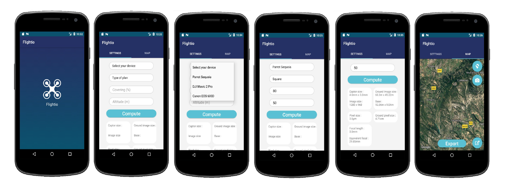
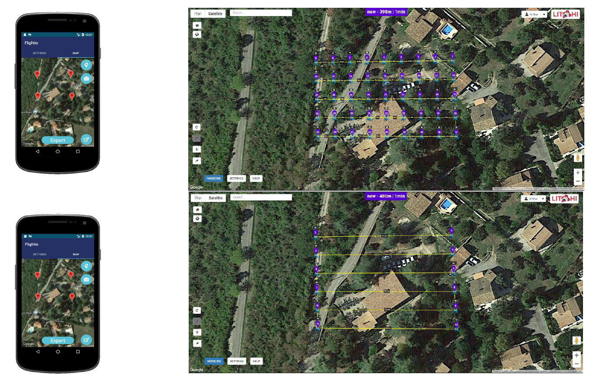

# flightio

**Android application for drone mapping**

## Welcome !

### Overview

**Flightio** is an android application made in Java for drone flight planning. This application is connected to your *flylitchi* account, and create a ready to go plan for your drone. The plan created make sure that you won't miss any photo for your mapping, especially if you want to create 3D models. Then, you will need at least 60% of coverage between each pictures. **Flightio** takes into account the camera specs of your drone, its altitude, speed and upload the plan on your account ! You can, of course, download the plan into your drone before the flight, so you won't be dependent on the internet connection.

  <b>Flightio Interface</b> 
  
   

### About

This project was made in only three intense days and take part in a bigger engineering project. 

## Usage

To use **Flightio**, simply connect to the application and provide the camera type that you want to use. All interns options (focal length, captor size etc.) of the most used cameras are saved in an external file, so you don't have to search for them. Specify the altitude, the speed and coverage, and you are ready to go. Swipe to the right to enter to the *Set Up* page, and mark your area with four points by clicking on the screen. To delete the markers, press the marker button.
When you are satisfied with your set up, export your map to *flylitchi* by pressing the export button. It will compute the plan for you, and automatically save the plan in your *flylitchi* account.

  <b>Tutorial</b> 
  
   

You can decide to stop your drone for each pictures or not. Because of the limit of stops in *flylitchi*, you may want to use the last option and set a low speed to avoid blurry pictures.

  <b>Flightio Options</b> 
  
   

Simple as that !

